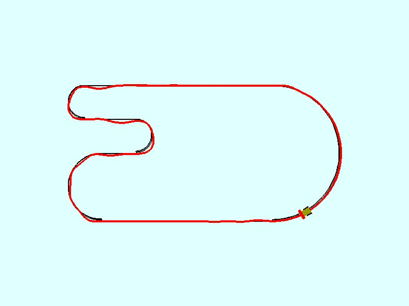
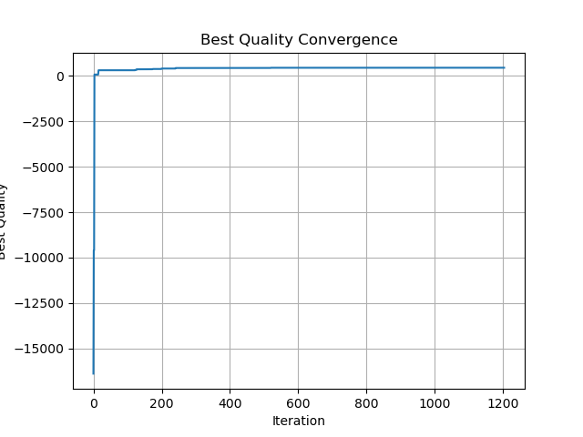
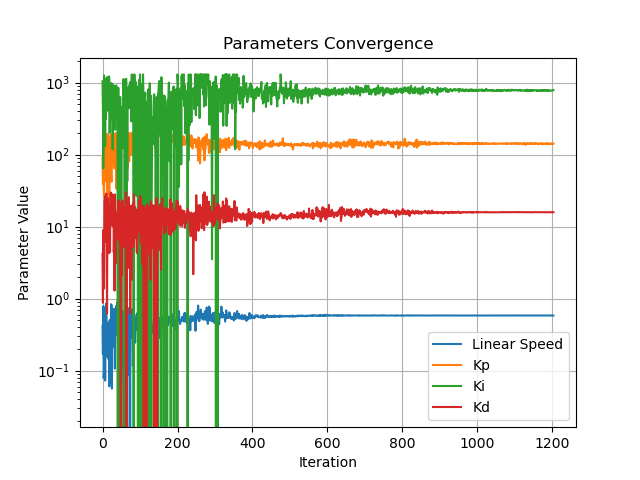
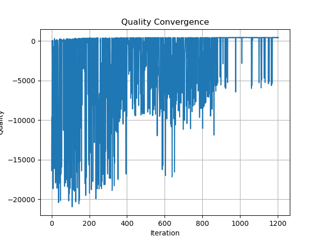

# Ant Colony Optimization for PID Tuning

This project applies Continuous Ant Colony Optimization (ACOR) to tune the gains of a PID controller for a simulated line-following robot. The robot and track are rendered with Pygame, and candidate controller settings are evaluated by running the simulation.

## Course context and contribution

This project was developed for **CT-213: Artificial Intelligence for Mobile Robotics**, as an adaptation of Lab 4: Optimization with PSO. The lab provides the Pygame line-following simulation, robot and track models, discrete PID controller, episode reward, and a PSO-based training loop. This project keeps that simulation as its testbed and replaces PSO with a custom Continuous Ant Colony Optimization (ACOR) implementation. ACOR searches the same four parameters—maximum linear speed and the PID gains—using an archive of ranked candidates and Gaussian sampling. The contribution here is the optimizer adaptation, its integration with the lab simulation, and the resulting experiments; the simulation framework is credited to the course lab.

## Overview

The optimizer searches for four parameters:

- Maximum linear speed command
- Proportional gain ($K_p$)
- Integral gain ($K_i$)
- Derivative gain ($K_d$)

Rather than maintaining a discrete pheromone table, the ACOR implementation keeps an archive of high-quality solutions. It samples Gaussian distributions centered on archived candidates to explore the continuous parameter space. The simulation reward favors forward motion aligned with the track while penalizing line-tracking error and loss of line detection.

The supplied experiment uses 40 ants, retains the best 12 solutions, and searches within these bounds:

| Parameter | Lower bound | Upper bound |
| --- | ---: | ---: |
| Maximum linear speed | 0.0 | 0.9 |
| $K_p$ | 10 | 200 |
| $K_i$ | 0 | 1300 |
| $K_d$ | 0 | 30 |

## Reward function

The optimizer maximizes the cumulative reward of each simulation episode. At each simulation step, the reward combines forward progress aligned with the track and a penalty for line-sensor error:

$$
r_t = (\mathbf{d}_t \cdot \mathbf{t}_t) v_t - 9|e_t|
$$

Here, $\mathbf{d}_t$ is the robot's forward direction, $\mathbf{t}_t$ is the track tangent, $v_t$ is the robot's linear velocity, and $e_t$ is the line-sensor error. If the sensor detects no line, the simulation substitutes $e_t = 3$, applying a strong penalty. The episode score is the sum of these per-step rewards, and ACOR uses that score to compare candidate speed and PID parameters.

## Requirements

The project requires Python 3.11 or newer and [uv](https://docs.astral.sh/uv/). Its cross-platform runtime dependencies (NumPy, Pygame, and Matplotlib) are declared in `pyproject.toml`. The existing [requirements.txt](requirements.txt) is a pinned environment snapshot and is not the dependency source used in the instructions below.

## Setup and run

Install `uv` if needed, then run these commands from the repository root. `uv sync` creates a local `.venv`, resolves dependencies for your platform, and installs them. `uv run` runs the application in that environment:

```bash
uv sync
uv run main.py
```

To run the optimizer's standalone example:

```bash
uv run test_aco.py
```

The optimizer starts in training mode and evaluates candidates over simulation episodes. The application displays the robot, track, current training iteration, and episode status.

### Keyboard controls

| Key | Action |
| --- | --- |
| `A` | Toggle accelerated simulation mode |
| `T` | Toggle training; when training is off, replay the best solution found so far |
| `P` | Plot the recorded optimization history |
| Up / Down | Increase / decrease the acceleration factor by 1 |
| Left / Right | Decrease / increase the acceleration factor by 10 |

Plots and the captured best-solution run are saved under `results/`.

## Testing the optimizer

Run the standalone optimization example within the project's uv environment:

```bash
uv run test_aco.py
```

This evaluates the optimizer against a three-variable quadratic reward with a known optimum at `[1, 2, 3]`, then plots the parameter and reward histories.

## Project structure

| File or directory | Purpose |
| --- | --- |
| `main.py` | Configures the robot, track, ACOR optimizer, and interactive Pygame loop |
| `ant_colony_optimization.py` | Implements ants, solution ranking, Gaussian sampling, and generation updates |
| `line_follower.py` | Robot line-sensor and PID controller behavior |
| `discrete_pid_controller.py` | Discrete-time PID controller |
| `simulation.py` | Robot/track simulation, episode evaluation, and rendering |
| `track.py` | Track geometry and track-related operations |
| `utils.py` | Shared vector, pose, parameter, and drawing utilities |
| `constants.py` | Simulation and control constants |
| `test_aco.py` | Standalone optimizer example using a known quadratic optimum |
| `results/` | Generated plots and the captured line-following result |

## Results

In the evaluated run, the robot followed straight sections well and negotiated curves with some overshoot. A good candidate appeared within roughly the first 200 iterations, with parameter values stabilizing at around 900 iterations. These results depend on the optimizer settings, track, and simulation setup.

### Best line-following run



### Optimization history







## Key reference

The continuous Ant Colony Optimization method implemented in this project is based primarily on the following paper:

> Socha, K., & Dorigo, M. (2008). Ant colony optimization for continuous domains. *European Journal of Operational Research, 185*(3), 1155–1173. https://doi.org/10.1016/j.ejor.2006.06.046

This paper introduces the ACOR approach—using a ranked archive of solutions and Gaussian mixtures to guide search in continuous spaces—which forms the core of this project's optimizer.